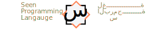

     

[Website]  |  [الموقع]

This is the main source code repository for [Rust]. It contains the compiler,
standard library, and documentation.

[Website]: https://seenlang.org/
[الموقع]: https://seenlang.org/ar
<!-- [Getting Started]: https://www.rust-lang.org/learn/get-started
[Learn]: https://www.rust-lang.org/learn
[Documentation]: https://www.rust-lang.org/learn#learn-use
[Contributing]: CONTRIBUTING.md -->

## objectives
- Bilingual programming language ( Arabic and English ).
- Code Generation: transpile to readable rust, javascript, html, css , python and more as needed.
- Multiplatform.
- Provide tools to work with Arabic 
- tranlsation between Arabic and English.
- Development tools , including an editor, cli.

## Status 
The project is still in its very early stages and needs lots of work before it becomes fully functional. 
The tools are good enough to run the demos provided in the website.

## Documentation
The following documents will be uploaded soon:
- Tutorial
- The Langauge Design
- Inspirations and Credits 
- Open and Known Issues
- Legal Docs
- Todo
- documentation will be provided in both English and Arabic

## The Language
### Name **س** 
( pronunciation sīn , like "Seen" ) is the twelfth letter of the Arabic alphabet,  the letter س is used in math to indicate unknown values and variables, the equivalent of "x" in English.
 
**Extension** : Files must have the extension : **.sn** or the Arabic extension **.س**

## License
**MIT license**.  

## Related Repositories
- [seen-compiler](https://github.com/abukhadra/seen-compiler)
- [seen-gen-html](https://github.com/abukhadra/seen-gen-html)
- [seen-gen-js](https://github.com/abukhadra/seen-gen-js)
- [seen-editor](https://github.com/abukhadra/seen-editor)
- [seen-playground](https://github.com/abukhadra/seen-playground)
