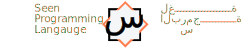

[Website]: https://seenlang.org/
[الموقع]: https://seenlang.org/ar

  <picture>
    <source media="(prefers-color-scheme: dark)" srcset="readme/dark-banner.svg">
    <source media="(prefers-color-scheme: light)" srcset="readme/light-banner.svg">
    
  </picture>

  [Website] &nbsp; &nbsp; &nbsp;|&nbsp; &nbsp; &nbsp; &nbsp; &nbsp; [الموقع]

 

pronunciation sīn , like "Seen" is the twelfth letter of the Arabic alphabet, the letter س is used in math to indicate  
&nbsp;&nbsp;&nbsp;&nbsp;unknown values and variables the equivalent of "x" in English.

Seen tools are developed in multiple repositories, the final build for each tool will be collected and uploaded here to centralize access

## objectives
- Bilingual programming language ( Arabic and English )
- Code Generation / transpilation
- Multiplatform, targeting web, mobile and desktop
- Provide Two solutions: 
  - Desktop version that can communicate with the Operating System.
  - Seen for web, works fully on the browser, 
- Development tools, including an editor and a cli
- Solve Arabic specific concerns, such as lack of Arabic language support.

## Approach
To make the project immediately useful and provide value other than being another programming langauge,  
the langauge will be trasnpiled to different underlying langauges to benifit from th ecosystems and developments  
already accomplished by these technologies  
Following is a list of targets the compiler will officially support:
- HTML/CSS/JS to provide tools that can run in the browser
- React Native for mobile development
- Rust otherwise
- Other Langauges if rust is not an option.

When the project matures enough, compiling to lower level code such as wasm and llvm might be an option.

## Status 
The project is still in its very early stages and needs lots of work before it becomes fully functional. 
The tools are good enough to run the examples provided in the website.  
Current focus:
- Compiler
  - importing JS files
  - Calling Seen from JS
  - semantic analyzer
  - Complete the HTML/CSS/JS generation 
- Editor
  - Project Explorer / Multi-files
  - Project Building
  - Package Management
  - Desktop version
- Expirements 
  - Generating Reactive Native 
  - Calling Python,
  - Generating Rust
 
## Documentation
The following will be provided soon in both English and Arabic and published on the official website:
- Tutorial
- The Langauge Design
- Inspirations and Credits 
- Open and Known Issues
- Legal Docs
- Todo

## License
**MIT license**.  

## CDN:
Examples and instructions for each tool are provided in their respective repositories
- Seen Compiler https://cdn.jsdelivr.net/gh/abukhadra/seen@latest/scomp.js
- Seen Editor https://cdn.jsdelivr.net/gh/abukhadra/seen@latest/sedit.js
- Seen Playground https://cdn.jsdelivr.net/gh/abukhadra/seen@latest/splay.js

## Related Repositories
- [seen-compiler](https://github.com/abukhadra/seen-compiler)
- [seen-gen-html](https://github.com/abukhadra/seen-gen-html)
- [seen-gen-js](https://github.com/abukhadra/seen-gen-js)
- [seen-editor](https://github.com/abukhadra/seen-editor)
- [seen-playground](https://github.com/abukhadra/seen-playground)
- [seen-utils](https://github.com/abukhadra/seen-utils)
